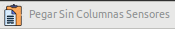
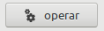

# GridviewDatosDamdata
Este programa es una utilidad que sirve para exportar datos de hojas de calculo al programa DAMDATA.

Teniendo los datos de sensores en hojas de calculo, este programa, exporta los datos en formatos .csv para que los podamos importar al programa DAMDATA.

Nota:
La primera columna contendrá la fecha, no importa que tenga incluida la hora, ya que podemos indicar al programa que se la añada.

## Flujo de uso del programa
#### DATOS
1) Copiamos los datos al portapapeles de la hoja de calculo.

1.a) En la siguiente captura, se muestra datos donde la primera fila indica nombre de sensores:


1.b) En la siguiente captura, se muestra datos donde hay columnas con nombre de sensores:


2) Dependiendo de como tengamos los datos en la hoja de cálculo, usaremos el botón "Pegar Sin Columnas Sensores"
, los datos los tendríamos con muestra la figura (1.a)

 o el botón "Pegar Datos" , para pegar los datos. (1.b)

Una vez realizado este paso, el gridview se rellena con los datos pegados:


#### Crear el fichero .csv
Para empezar a crear el fichero .csv, hay que indicar el nombre del sensor. Haciendo doble click en la columna del nombre del sensor en el gridview, se rellena automaticamente el textbox "Nombre Sensor"  

Al hacer también doble click, en la columna del dato del gridview, se rellena el textbox "Columna Datos:" automaticamente.  

Si los datos de la columna de fecha (1º columna del gridviews), no contienen la hora, hay que activar el valuebox "Hora" , para que se le añada.

Y si la 1º fila tiene los nombres de las columnas  hay que activar el valuebox "Con Cabecera" , para que no la tenga en cuenta.

**En nuestro ejemplo:**

La 1º fila del gridview no contiene cabeceras:


y la 1º columna, no tiene hora indicada en la fecha:


Para generar el fichero .csv, tenemos que pulsar el botón "Operar" 

Y obtendremos la siguiente pantalla:


El gridview contiene los datos originales.

El gridview son los datos del sensor que hemos exportados.

El es el contenido del fichero .csv resultante.

y se genera en el directorio /home/usuario/PDF, el fichero de datos .csv con el nombre del textbox "Nombre Sensor":


Que podrá ser importado a DAMDATA.

#### EXTRA: Herramienta SCRIPT

Con el botón SCRIPT , se abre un formulario más avanzado, donde podemos automatizar el proceso de crear ficheros .csv cuando hemos cargado muchas columnas de datos de sensores, permitiendo la creación automática de múltiples ficheros .csv.

[](https://www.youtube.com/watch?v=104T2j7HP9M)

### Pre-requisitos instalación programa 📋

Debes de tener instalado gambas3.16.
Puedes usar el PPA:

```
sudo add-apt-repository ppa:gambas-team/gambas3  
sudo apt-get update
sudo apt-get install gambas3
```

### Instalación 🔧

Puedes seguir los pasos indicados en este [enlace][enlace]:

[enlace]: https://gist.github.com/Nando98/2cd5fc89cb7cfbe9b5fba56220d05307

## Autores ✒️

* **Julio Sanchez Berro**

## Licencia 📄

GPLv3
